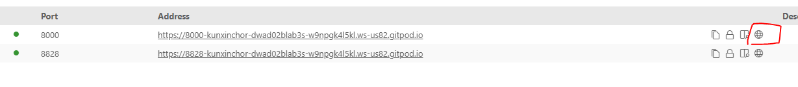

# Running the code On Gitpod

To preview the website when using Gitpod, in the terminal, run the following code:

`python -m http.server`

This will start a HTTP server (installed with Python). After which, go to _Ports_ and click on the globe icon next to it:

